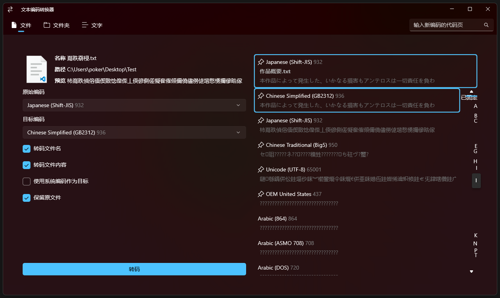
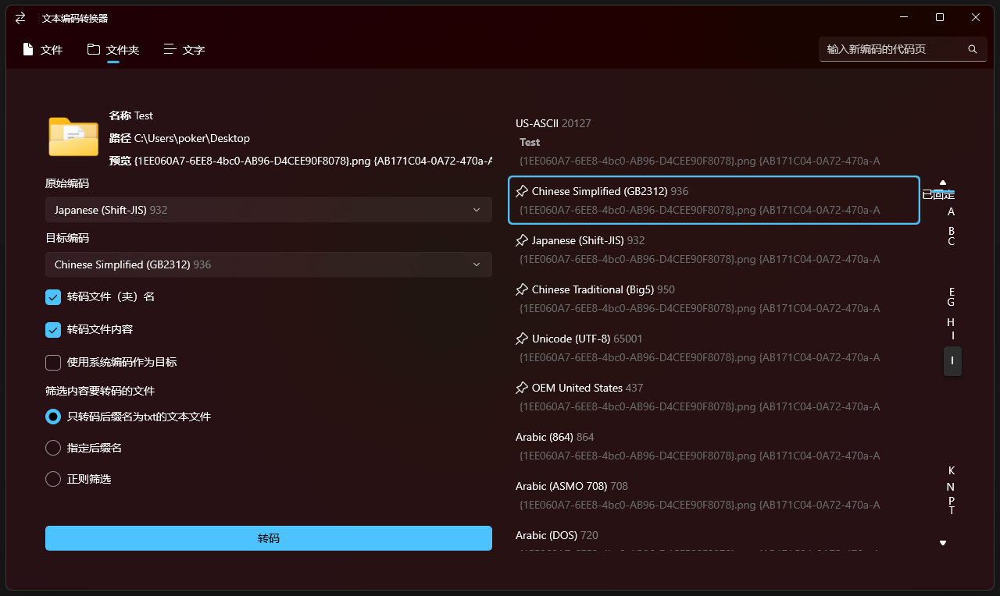
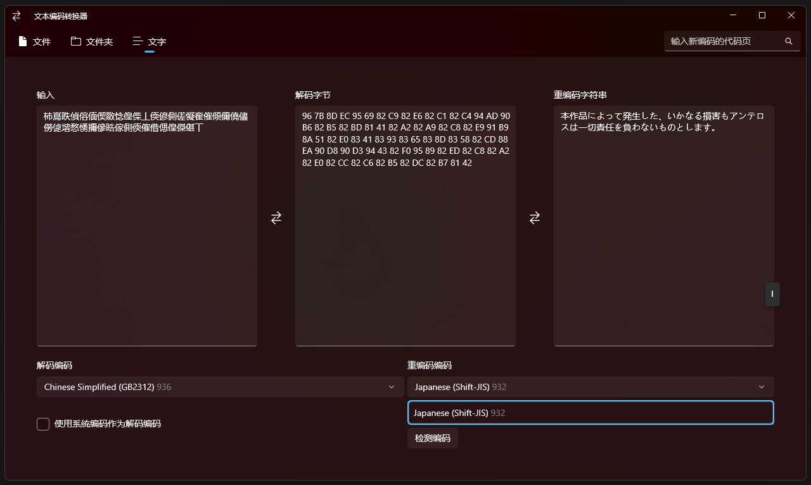

# EncodeConverter

在Win10及以上计算机运行的文本编码转换器，基于[.NET 8](https://dotnet.microsoft.com/zh-cn/download/dotnet/8.0)

## 写这个的原因

之前[Perfare](https://www.perfare.net/)大佬写过一个NTIConverter，十分好用。
但后来作者不更新了，运行要安装旧的运行库.NET Framework 3.5，而且编码类型较少，功能也不够强大。
故仿照大佬写了一个类似的。

## 功能

* 支持所有现有的编码

* 支持对单个文件或文件夹内所有指定文件（名称、内容）进行转换

* 指定文件时可以使用后缀名、或正则表达式匹配，或默认只转换txt文本文件

* 可以让程序自动检测文件编码（使用[UTF Unknown](https://github.com/CharsetDetector/UTF-unknown)实现），
也可以手动指定编码

* 可以将乱码文本复制到文本框内进行转换

* 也支持拖放文件，但需要点击“转换”后才会进行转换

## 预览

